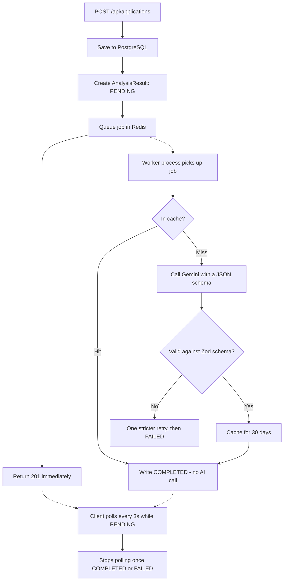

# HireGrid

A job application tracker that tells you how well your resume matches each job
you apply to.

Most trackers are a spreadsheet with a nicer interface. HireGrid adds the part
that actually helps: it reads your resume and the job description together and
returns a match score, the required skills you're missing, ATS keyword gaps, and
specific suggestions for tailoring the resume to that posting.

> **Status: in progress.** Authentication, application tracking with a status
> pipeline and audit timeline, resume upload with text extraction, the
> asynchronous AI analysis pipeline, the searchable/filterable table view and
> the analytics dashboard are all built and working. A profile page is still to
> come.

---

## Features

**Working now**

- Email and password auth — bcrypt hashing, JWT in an httpOnly cookie
- Track applications through a seven-stage pipeline: Saved, Applied, Online Assessment, Tech Interview, HR Interview, Offer — with Rejected reachable from any stage
- Every status change is recorded in an append-only timeline, so the history can't be rewritten
- Upload resumes as PDF or DOCX; text is extracted server-side and stored for analysis
- File type verified by magic bytes, not by the file extension
- AI analysis against any job description: match score, required vs. preferred skills, matched vs. missing skills, ATS keywords, tailoring suggestions
- Analysis runs in a background worker, so saving an application returns immediately
- Identical resume + job description pairs are served from cache without a second AI call
- Searchable, filterable, sortable table: search across company, role and location; filter by status, employment type, work mode, resume used and applied-date range; sort by company or applied date; paginated
- Analytics dashboard: five summary figures, a status funnel, an 8-week match-score trend, aggregated skill gaps, applications going stale, and a recent-activity feed — computed in one query batch and cached in Redis per user
- 150 automated tests

**Planned**

- Profile page

---

## How the analysis pipeline works

This is the part of the project worth reading the code for.

An AI call takes several seconds. Making the user's browser wait for it would
tie up a connection per request and make saving an application feel broken. So
the API never calls the AI at all — it queues the work and returns.



**The cache key is a SHA-256 hash of the resume text and the job description**,
not the application ID. That means two different applications created from the
same posting and the same resume share one AI call — and editing either text
changes the hash, so a fresh analysis happens automatically.

**Provider failures are classified before they're acted on.** A 429, a 503 or a
network timeout means "the request was fine, ask again later", so it's re-thrown
for the queue to retry with exponential backoff while the analysis stays
`PENDING`. A 400, a bad API key or an unparseable response means the same call
will fail the same way in thirty seconds, so it fails fast and the UI offers a
Retry button. Treating both the same way is how a temporary blip becomes a
permanent failure on the user's screen.

---

## Tech stack

**Client** — React 18, TypeScript, Vite, Tailwind CSS v4, React Router,
TanStack Query, TanStack Table, Recharts, Axios

**Server** — Node.js, Express 5, TypeScript, Prisma ORM, Zod, JWT + bcrypt,
Multer, pdf-parse, mammoth, BullMQ

**Infrastructure** — PostgreSQL 15, Redis 7, Docker Compose, Google Gemini API

A few choices worth explaining:

| Choice | Why |
| --- | --- |
| Express **5** | Async errors are forwarded to the error middleware automatically — no `try/catch` in every handler |
| **BullMQ + Redis** over an in-process background task | Jobs live in Redis, so a worker crash or restart doesn't lose them. Retries and backoff come for free |
| JWT in an **httpOnly cookie**, not `localStorage` | `localStorage` is readable by any script on the page, which makes XSS a token theft |
| **Zod** validating the AI's response | The request already constrains the model to a JSON schema, but "rare" isn't "impossible" and this data goes into the database |
| Owned-record queries return **404, not 403** | A 403 confirms the record exists. A 404 tells an attacker nothing |

---

## Prerequisites

| Tool | Version | Notes |
| --- | --- | --- |
| Node.js | 24 LTS | `node -v` — npm ships with it |
| Docker Desktop | latest | Runs PostgreSQL and Redis. Needs WSL2 on Windows |
| Git | any recent | |

A free Gemini API key: <https://aistudio.google.com/app/apikey>

---

## Getting started

```bash
# 1. Start PostgreSQL and Redis
docker compose up -d
docker compose ps          # wait until both report "healthy"

# 2. Configure and start the API
cd server
cp .env.example .env       # Windows PowerShell: Copy-Item .env.example .env
# edit .env — set a real JWT_SECRET and GEMINI_API_KEY
npm install
npm run prisma:migrate     # create the database schema
npm run dev                # → http://localhost:4000

# 3. Start the analysis worker (second terminal)
cd server
npm run worker

# 4. Start the client (third terminal)
cd client
cp .env.example .env
npm install
npm run dev                # → http://localhost:5173
```

Generate a `JWT_SECRET`:

```bash
node -e "console.log(require('crypto').randomBytes(48).toString('hex'))"
```

Open <http://localhost:5173> and sign up.

> **Three processes, not two.** The API, the worker and the client each need
> their own terminal. The worker is separate on purpose — a slow AI call must
> not occupy an HTTP connection, and the worker can be restarted or scaled
> independently of the API. If analyses stay stuck on "Analyzing…", the worker
> isn't running.

---

## API

All routes are prefixed with `/api`. Everything except `/health` and the auth
routes requires the session cookie, and every query is scoped to the
authenticated user.

| Method | Route | Does |
| --- | --- | --- |
| `GET` | `/health` | Liveness check |
| `GET` | `/dashboard` | Every dashboard figure in one payload (cached 5 min per user) |
| `POST` | `/auth/signup` | Create an account |
| `POST` | `/auth/login` | Log in, sets the session cookie |
| `POST` | `/auth/logout` | Clear the session cookie |
| `GET` | `/auth/me` | Current user |
| `GET` | `/applications` | List, with search, filters, sorting and pagination |
| `POST` | `/applications` | Create one (queues an analysis if a resume is attached) |
| `GET` | `/applications/:id` | One application, with its status timeline |
| `PUT` | `/applications/:id` | Update |
| `DELETE` | `/applications/:id` | Delete |
| `PATCH` | `/applications/:id/status` | Change status, appending to the timeline |
| `GET` | `/applications/:id/analysis` | Analysis result and its status |
| `POST` | `/applications/:id/reanalyze` | Re-queue the analysis |
| `POST` | `/resumes` | Upload a PDF or DOCX |
| `GET` | `/resumes` | List uploaded resumes |
| `GET` | `/resumes/:id` | Resume metadata |
| `GET` | `/resumes/:id/download` | Download the original file |
| `DELETE` | `/resumes/:id` | Delete (blocked if used by an application) |

---

## Project layout

```
hiregrid/
├── client/                 # React + Vite frontend
│   └── src/
│       ├── api/            # Axios instance + one module per API resource
│       ├── components/     # Reusable UI built with Tailwind utilities
│       ├── context/        # AuthContext
│       ├── hooks/          # React Query hooks — all server state
│       ├── pages/          # Route-level components
│       └── types/          # Shared TypeScript interfaces
│
├── server/                 # Express + Prisma API
│   ├── prisma/             # schema.prisma and migrations
│   └── src/
│       ├── config/         # env validation, db and redis clients
│       ├── controllers/    # Request handlers
│       ├── middleware/     # Auth, error handling, uploads
│       ├── queues/         # BullMQ queue and worker
│       ├── routes/         # Route definitions only — no logic
│       ├── services/       # Business logic
│       ├── utils/          # Errors, hashing, Zod schemas
│       └── worker.ts       # Worker process entry point
│
├── docker-compose.yml      # PostgreSQL + Redis
└── README.md
```

Requests flow **route → controller → service**. Routes stay declarative,
controllers handle request and response, services hold the business logic and
all database access.

---

## Testing

```bash
cd server
npm test
```

100 tests across four suites, covering authentication and session handling,
application CRUD with ownership scoping, file upload and type validation, and
the analysis pipeline — including cache hits, malformed AI responses, and the
retryable-vs-permanent error split.

Redis, the queue, Prisma and Gemini are mocked. The questions these tests ask
are about control flow: is the cache always checked before the AI, does a cache
hit really skip the call, does a malformed response get exactly one retry and
then become `FAILED` instead of crashing the worker. None of those need real
infrastructure — and mocking the model is the only way to test a misbehaving one
at all.

---

## Scripts

From `server/`:

| Command | Does |
| --- | --- |
| `npm run dev` | Start the API with hot reload |
| `npm run worker` | Start the AI analysis worker (required for analyses to run) |
| `npm test` | Run the test suite |
| `npm run build` | Type-check and compile to `dist/` |
| `npm start` | Run the compiled build |
| `npm run typecheck` | Type-check without emitting |
| `npm run prisma:generate` | Regenerate the Prisma client |
| `npm run prisma:migrate` | Create and apply a migration |
| `npm run prisma:studio` | Browse the database in a GUI |

From `client/`:

| Command | Does |
| --- | --- |
| `npm run dev` | Start the Vite dev server on :5173 |
| `npm run build` | Type-check and build for production |
| `npm run preview` | Serve the production build locally |
| `npm run typecheck` | Type-check only |

---

## Docker

```bash
docker compose up -d      # start
docker compose ps         # status
docker compose logs -f    # follow logs
docker compose down       # stop, keeping data
docker compose down -v    # stop and DELETE all data
```

---

## Troubleshooting

**An analysis is stuck on "Analyzing…"** — the worker isn't running. Start it
with `npm run worker` in `server/`. The API only queues jobs; the worker
processes them.

**An analysis comes back FAILED** — check the worker's terminal. The usual
causes are an invalid `GEMINI_API_KEY`, a `GEMINI_MODEL` your key can't reach,
or the free tier's rate limit. The application itself is unaffected — press
**Retry analysis**.

**Analyses time out** — some Gemini models reason at length before producing
output, which can exceed the request timeout when combined with constrained JSON
decoding. Set `GEMINI_MODEL` in `server/.env` to a faster model; the default is
`gemini-3.5-flash-lite`.

**"Cannot reach the API server"** — the API isn't running, or `VITE_API_URL`
doesn't match the server's `PORT`. Vite inlines env variables at startup, so
restart `npm run dev` after editing `client/.env`.

**A CORS error in the browser console** — `CLIENT_URL` in `server/.env` must
match the browser's origin exactly: scheme, host, port, no trailing slash.

**"Port 5173 is already in use"** — an old dev server is still running. On
Windows: `netstat -ano | findstr :5173`, then `taskkill /PID <pid> /F`.

**Server exits with "Invalid environment configuration"** — working as
intended. It names the variables that are missing or malformed; fix them in
`server/.env`.

**`docker compose up` fails on Windows** — Docker Desktop must be running and
WSL2 enabled.
